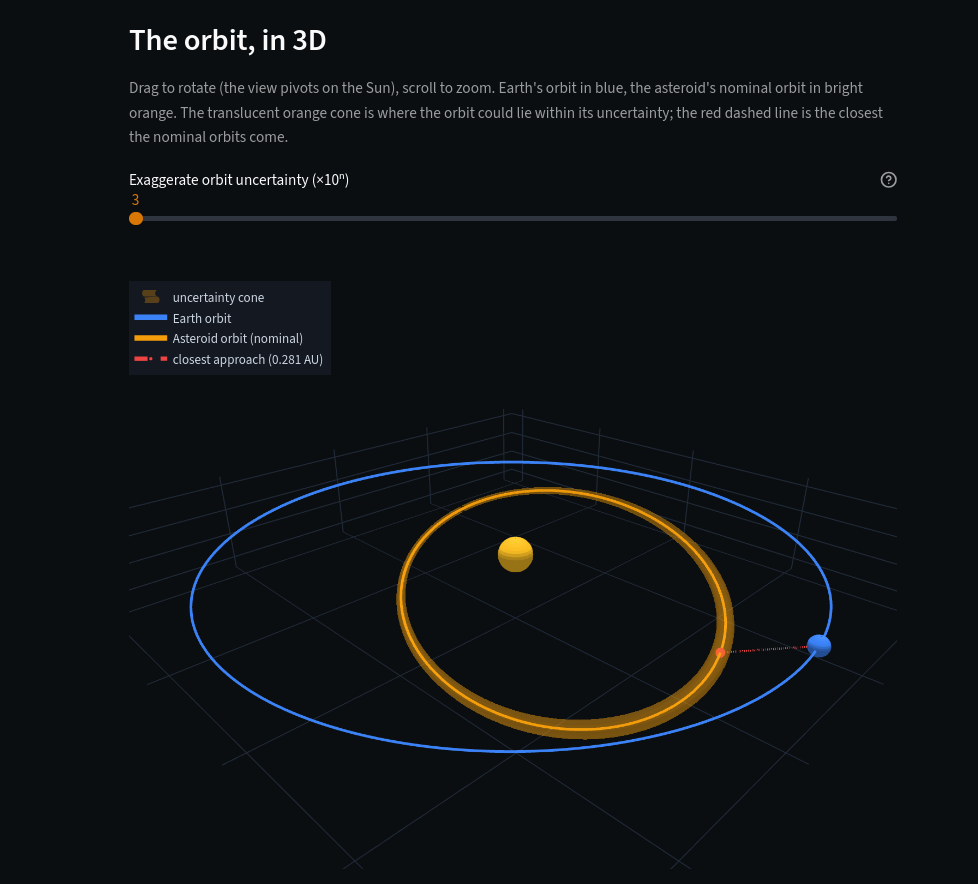
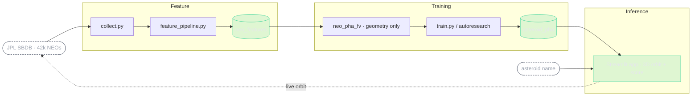
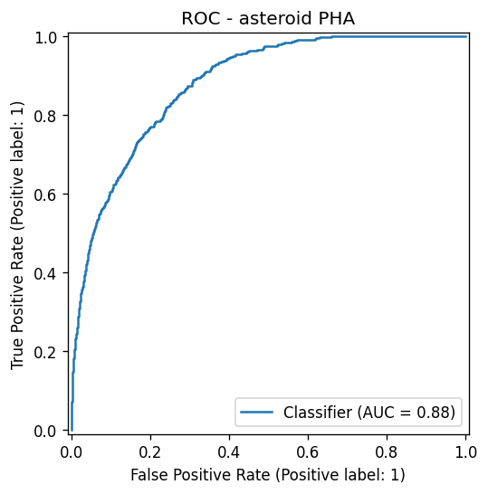
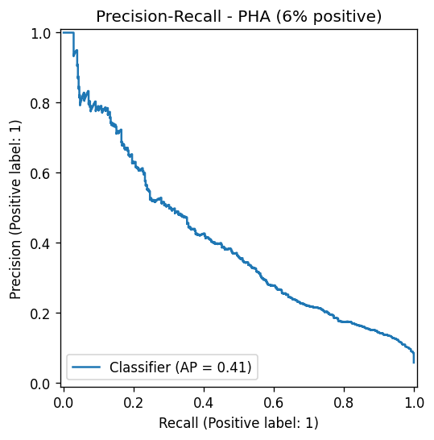
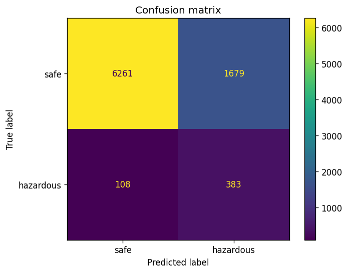
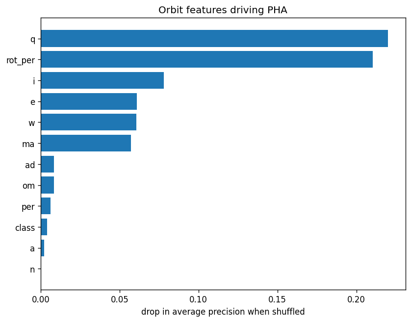

# Asteroid Doomsday-o-meter


[](https://github.com/MagicLex/awesome-ml-systems)
[](https://www.hopsworks.ai/)

One small ML system per day on Hopsworks.

Can you tell whether a near-Earth asteroid is classified "potentially hazardous"
from the shape of its orbit alone?

Catch: "potentially hazardous" (PHA) is *defined* as MOID ≤ 0.05 AU and absolute
magnitude H ≤ 22 (close orbit and big enough). Feed the model MOID and H and the
problem is a tautology. So the model never sees MOID, H, or the size proxies
(diameter, albedo). It predicts PHA from orbit **geometry** only: semi-major
axis, eccentricity, inclination, perihelion, aphelion, period, node, argument of
perihelion, rotation. That captures the "does this orbit come close to Earth"
half of the definition. It cannot see the size half. Honest and non-trivial.

Data: the full near-Earth object catalogue from the
[JPL Small-Body Database](https://ssd-api.jpl.nasa.gov/doc/sbdb_query.html)
(free, no key, one request). 42,153 NEOs, 2,545 of them flagged PHA (6%).

Built on [Hopsworks](https://www.hopsworks.ai/) as an FTI (feature, training,
inference) system, forked from the
[readme-vaporware-score](https://github.com/MagicLex/readme-vaporware-score)
base patterns.



## Pipeline



## Result

From orbit geometry alone (no MOID, H, or size), 5-fold CV:

| metric | value |
|---|---:|
| ROC-AUC | 0.86 |
| average precision | 0.34 (6% baseline = 0.06) |

The orbit shape predicts the "comes close to Earth" half of the PHA definition
well; it cannot see the size half, which caps it below 1.0. Honest.

### The leakage we caught

First run scored ROC-AUC 0.985, which was too good. Cause: Hopsworks lowercases
feature names, so the stored column is `h`, but the exclusion list said `"H"`.
Absolute magnitude H (the size half of the PHA definition) leaked straight in.
Fixing the exclusion to lowercase dropped it to an honest 0.86. Same lesson as
every project here: if the model looks great, check what it is allowed to see.

## Model evaluation

| | |
|---|---|
|  |  |
|  |  |

Perihelion distance `q` and rotation period `rot_per` carry most of the signal.
`q` is how close the orbit's nearest point sits to 1 AU, the "comes close to
Earth" half of the definition. `rot_per` is a soft observability/size proxy (only
larger, well-observed bodies have a measured spin), which is as near as the model
gets to the size half it is forbidden to see.

## What the model actually predicts

The 3D orbit, the MOID, the closest approach, the variation forecast: all of that
is deterministic celestial mechanics computed from the orbital elements, not
prediction. The one predicted number is the **doomsday score**, where
`asteroid_pha` maps the orbital elements to a probability of being PHA.

Because PHA is *defined* by MOID and size, and the model is barred from both, what
it really does is re-derive the "close approach" half from geometry (the same
quantity the orbit view computes exactly) and lean on `rot_per` as a weak size
proxy. It cannot see the size half, so it cannot fully determine the label. That
is the 0.86 ceiling, and why the task is honest rather than a tautology.

## Status

- [x] Collector (`collect/collect.py`): JPL SBDB -> `data/neos.jsonl`
- [x] Feature pipeline -> offline feature group `neo_features` (Hopsworks job)
- [x] Orbit-geometry-only feature view + PHA classifier, ROC-AUC 0.86 (Hopsworks job)
- [x] Scorer app (`app/app.py`): type an asteroid -> live JPL orbit -> doomsday score
- [x] **Orbit-trajectory visual:** the asteroid's orbital ellipse vs Earth's,
      from a/e/i/Ω/ω, drawn top-down and edge-on so you *see* the close approach.
      The real JPL MOID is shown alongside the model's geometry-only prediction
      (honest: MOID is never a model feature). Orbit math validated against JPL
      MOID for Eros/Ceres (0.150 vs 0.149, 1.585 vs 1.58).
- [x] **Deployed** as a Hopsworks Streamlit app (`app/deploy_app.py`), env
      `asteroid-app-env` (python-app-pipeline + the model's pinned sklearn stack).

## Reproduce

```bash
python collect/collect.py     # pull the NEO catalogue (free, no key)
# feature pipeline + train run as Hopsworks jobs (see pipelines/)
```

## Leakage rules (the honest part)

Excluded from the model: `moid`, `H` (the literal PHA definition) and
`diameter`, `albedo` (size proxies derived from H). Kept: orbital elements +
rotation period + orbit class. The label is `pha`.
