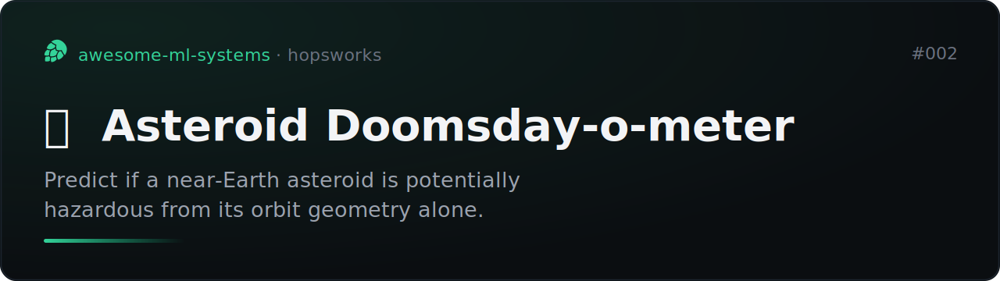
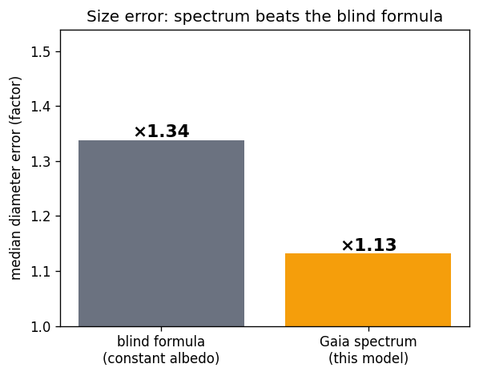
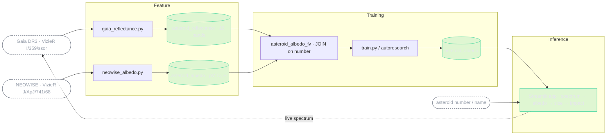
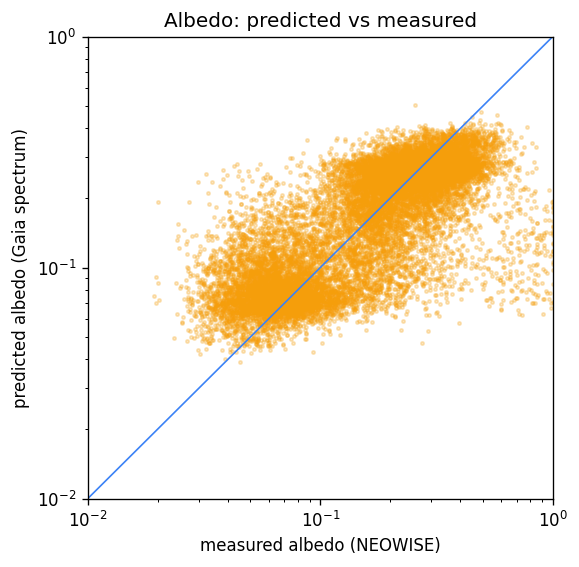
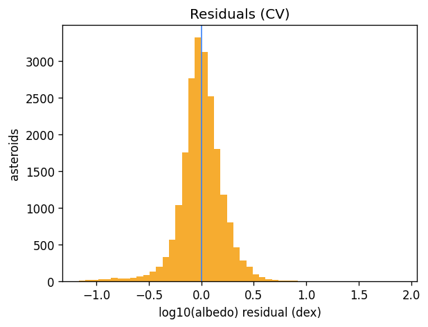
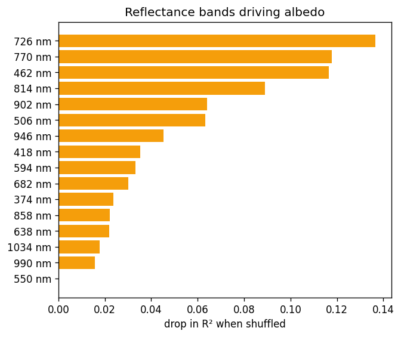

# Asteroid Doomsday-o-meter



[](https://github.com/MagicLex/awesome-ml-systems)
[](https://www.hopsworks.ai/)

One small ML system per day on Hopsworks.

**97% of known asteroids have no measured size.** Size is what decides whether an
impact is a city-killer or a footnote, and it follows from the albedo (how
reflective the rock is), but measuring albedo needs thermal-infrared from a space
telescope, which we only have for ~3% of objects. For the rest, everyone falls
back to a blind guess: *assume albedo ≈ 0.14 and convert brightness to size.*

This system does better. It reads the albedo off the asteroid's **Gaia DR3
reflectance spectrum** (cheap, available for 60,000 asteroids) and turns it into a
size, and a size into an impact scenario. For the objects nobody has measured,
it's the only number going, and it's measurably sharper than the blind guess.

The error compounds: mass and impact energy scale as diameter cubed, so the blind
guess's typical ×1.4 size miss is roughly a ×3 error in the energy you'd use to
rank an object's threat, in a direction nobody can see, for the uncharacterized
majority. Halving the size error is the cheapest way to make that triage less
blind.

## Result

Predict visible albedo from the 16-band Gaia spectrum, 5-fold CV on the 21,046
asteroids that have both a Gaia spectrum and a NASA/NEOWISE albedo:



| metric | value |
|---|---:|
| CV R² (log-albedo) | 0.60 |
| albedo MAE | 0.15 dex |
| **median diameter error: blind formula → this model** | **×1.34 → ×1.13** |

Halving the size error matters: diameter `D = 1329·10^(−H/5)/√albedo`, so a tighter
albedo is a tighter size, mass, and impact energy for every uncharacterized object.

### Why this works (and the dead end it replaced)

This project started as "predict "potentially hazardous" from an asteroid's
**orbit**". That turned out to be near-tautological: the hazard flag is *defined*
by the orbit's closest approach, which the orbit geometry already determines. And
the orbit carries almost no information about size, predicting albedo from orbital
elements beat the blind formula by ~4% (×1.44 → ×1.40), i.e. not at all.

The fix was not a better model, it was **better data**. An asteroid's *spectrum*
encodes its composition (dark carbonaceous vs bright silicate), and composition
sets albedo. Swapping the orbit catalogue for Gaia reflectance took the size error
from ×1.40 to ×1.13. The lesson: when a target is signal-thin, change the signal.

## Pipeline

Two external catalogues become two feature groups; the **join lives in the feature
view**, on the asteroid number, the model never sees a pre-baked table.



## Model evaluation

| | |
|---|---|
|  |  |
|  |  |

The model leans on the red/near-infrared bands, where rocky S-types and dark
C-types diverge most, the same colour difference a human eye would call "reddish
rock" vs "charcoal". `autoresearch/` logs the full search; XGBoost on the raw
spectrum won, and engineered spectral features (slopes, band depths) did not help,
because the trees already recover them from the bands.

## Data

- **Features**: Gaia DR3 mean reflectance spectra ([VizieR I/359/ssor](https://vizier.cds.unistra.fr/viz-bin/VizieR?-source=I/359)),
  16 bands 374–1034 nm, 34,577 numbered asteroids with a complete spectrum.
- **Label**: NEOWISE thermal-model albedo + diameter (Masiero+ 2011,
  [VizieR J/ApJ/741/68](https://vizier.cds.unistra.fr/viz-bin/VizieR?-source=J/ApJ/741/68)),
  52,113 asteroids. Joined to the spectra on asteroid number → 21,046 training rows.

## Honesty rules

- The model sees **only the Gaia reflectance**. Albedo, diameter and H are never
  features, they are the label and the downstream physics.
- The app shows the **measured NASA albedo next to ours** whenever it exists, so
  you can judge the model on objects it was never trained to copy. Where NASA has
  no measurement (the 97%), ours is presented as an estimate, not a fact.
- The impact scenario (energy, crater) is hypothetical and physics-only; most of
  these objects are main-belt and will never come near Earth.

## Reproduce

```bash
# feature + training pipelines run as Hopsworks jobs (or from a terminal pod)
python pipelines/gaia_reflectance.py   # Gaia spectra  -> FG asteroid_reflectance
python pipelines/neowise_albedo.py     # NEOWISE albedo -> FG asteroid_albedo
python pipelines/train.py              # FV join -> XGBoost -> model registry
```

The app (`app/app.py`) is a Hopsworks Streamlit deployment: type an asteroid, it
fetches the live Gaia spectrum, predicts albedo, and renders the size and impact.
